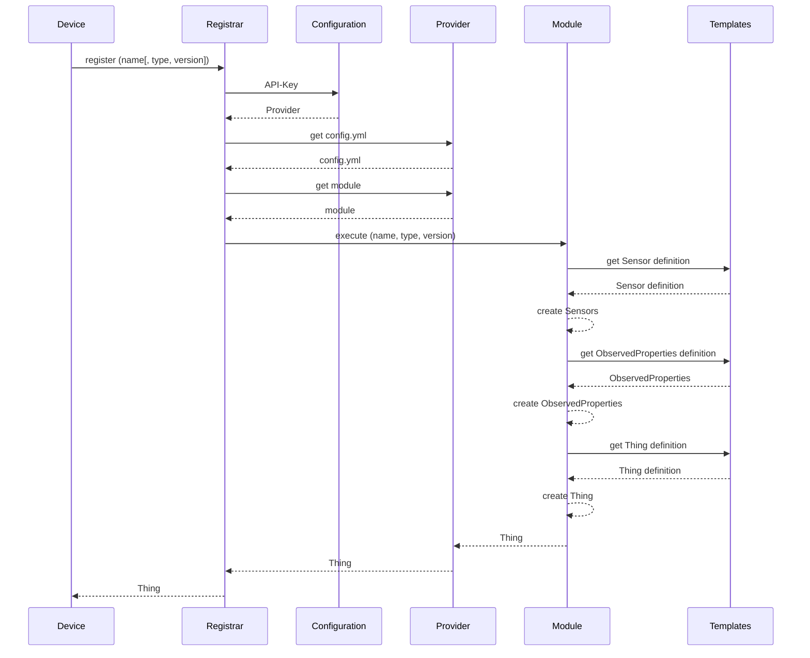

# IoT-Registrar

## Sequence Diagram



## Every time a device wakes up:

POST :serviceUrl/`register`
API-KEY: PeP

Body:
```
{
	"name": "490154203237517"
}
```

Body with location:
```
{
	"name": "490154203237517",
	"location": {
		"name": "At the factory",
		"description": "initiele locatie",
		"encodingType": "application/vnd.geo+json",
		"location": {
			"type": "Point",
			"coordinates": [
				3.7,
				51.08
			]
		}
	}
}
```


Response:
```
{
	"name": "490154203237517",
	"description": "490154203237517",
	"properties": {
		"type": "default",
		"version": "default",
		"sendTable": [3600],
		"sendfrequency": 10
	},
	"id": 132
}
```
